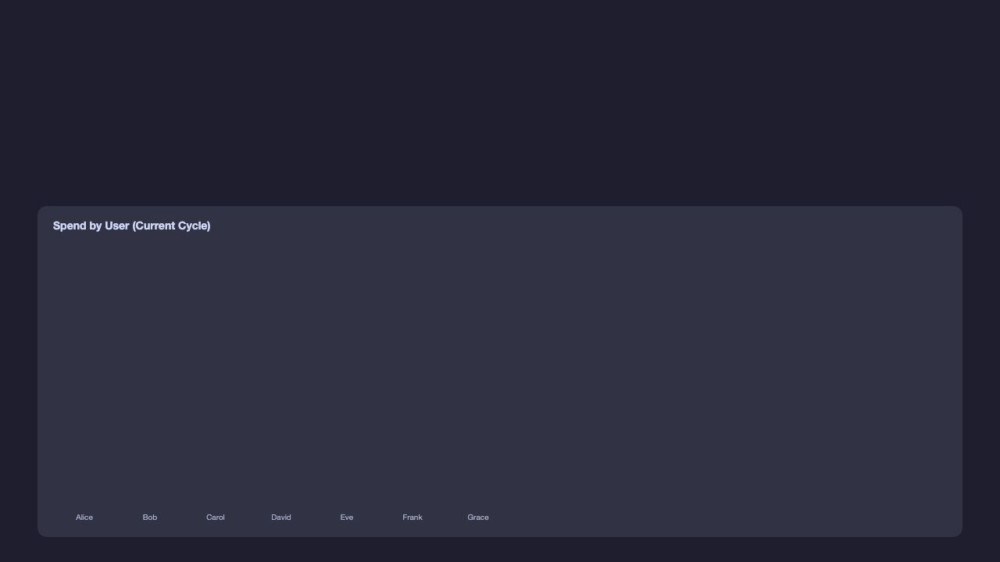
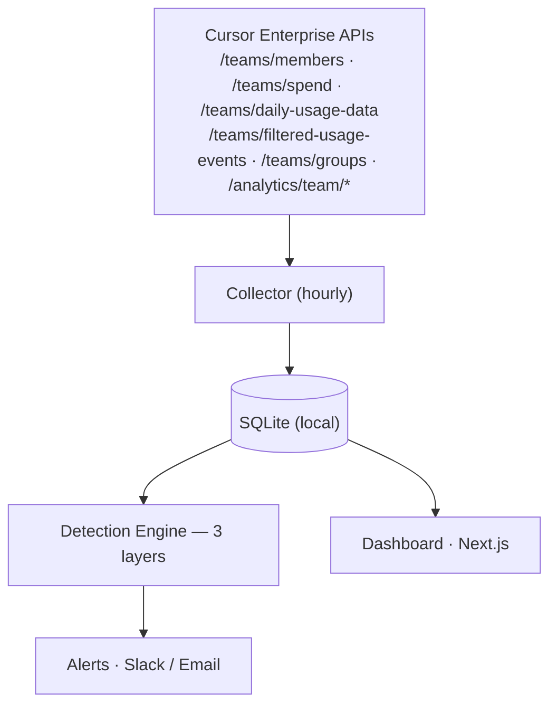

<p align="center">
  
</p>

<h1 align="center">Cursor Usage Tracker</h1>

<p align="center">
  <a href="https://opensource.org/licenses/MIT"></a>
  <a href="https://www.typescriptlang.org/"></a>
  <a href="https://www.docker.com/"></a>
</p>

**Your company has 50+ developers on Cursor. Do you know who's spending $200/day on Claude Opus while everyone else uses Sonnet?**

You're about to find out.



<sub>Demo animation created with <a href="https://github.com/ofershap/remotion-readme-kit">remotion-readme-kit</a></sub>

---

## The Problem

You're managing Cursor for your engineering team. The bill comes in. It's... a lot.

- **Who** is driving the cost?
- **When** did it start spiking?
- **Why** — is it a model shift? A runaway agent? Legitimate heavy usage?
- **How long** until someone notices?

Cursor's built-in dashboard shows data, but has **no anomaly detection** and **no proactive alerting**. You find out about cost spikes when the invoice arrives — weeks too late.

## The Solution

cursor-usage-tracker connects to Cursor's Enterprise APIs, collects usage data, and **automatically detects anomalies** across three layers of intelligence. When something looks off, you get a Slack message or email — not next month, but within the hour.

```
Developer uses Cursor → API collects data hourly → Engine detects anomaly → You get a Slack alert
```

### How It Works

| What happens                                 | Example                                                 |
| -------------------------------------------- | ------------------------------------------------------- |
| A developer exceeds the spend limit          | `Bob spent $82 this cycle (limit: $50)` → Slack alert   |
| Someone's usage is 3x their personal average | `Token spike: 4.2x Alice's 7-day average` → Slack alert |
| A user is statistically far from the team    | `Bob: 2.8 std devs above team mean` → Slack alert       |
| Someone shifts to expensive models           | `Opus usage jumped from 5% to 45%` → Slack alert        |
| Usage drifts above team P75 for days         | `Above team P75 for 5 of last 6 days` → Slack alert     |

Every alert includes **who**, **what model**, **how much**, and a **link to their dashboard page** for instant investigation.

---

## Features

### Three-Layer Anomaly Detection

| Layer          | Method        | What it catches                                                             |
| -------------- | ------------- | --------------------------------------------------------------------------- |
| **Thresholds** | Static limits | Spend > $50/cycle, > 500 requests/day, > 5M tokens/day                      |
| **Z-Score**    | Statistical   | User 2+ standard deviations above team mean                                 |
| **Trends**     | Behavioral    | Personal spikes, sustained drift above P75, model shift to expensive models |

### Incident Lifecycle (MTTD / MTTI / MTTR)

Every anomaly becomes a tracked incident with full lifecycle metrics:

```
Anomaly Detected ──→ Alert Sent ──→ Acknowledged ──→ Resolved
       │                  │               │              │
       └──── MTTD ────────┘               │              │
                                          └── MTTI ──────┘
       └────────────────── MTTR ─────────────────────────┘
```

- **MTTD** — Mean Time to Detect: how fast the system catches it
- **MTTI** — Mean Time to Identify: how fast a human acknowledges it
- **MTTR** — Mean Time to Resolve: how fast it's fixed

### Rich Alerting

- **Slack** — Block Kit messages with severity, user, model, value vs threshold, and dashboard links
- **Email** — HTML-formatted alerts with the same context

### Web Dashboard

| Page               | What you see                                                                                                                                                        |
| ------------------ | ------------------------------------------------------------------------------------------------------------------------------------------------------------------- |
| **Team Overview**  | Stat cards, spend by user, daily spend trend, spend breakdown, members table with search/sort, **group filter dropdown**, billing cycle progress, time range picker |
| **Insights**       | DAU chart, model adoption trends, model efficiency rankings (cost/precision), MCP tool usage, file extensions, client versions                                      |
| **User Drilldown** | Per-user token timeline, model breakdown, feature usage, activity profile, anomaly history                                                                          |
| **Anomalies**      | Open incidents, MTTD/MTTI/MTTR metrics, full anomaly timeline                                                                                                       |
| **Settings**       | Detection thresholds, **billing group management** (rename, assign, create), **HiBob CSV import** with change preview                                               |

---

## Quick Start

### Prerequisites

| What                   | Where to get it                                         |
| ---------------------- | ------------------------------------------------------- |
| Cursor Enterprise plan | Required for API access                                 |
| Admin API key          | Cursor dashboard → Settings → Advanced → Admin API Keys |
| Node.js 18+            | [nodejs.org](https://nodejs.org)                        |

### 1. Clone and install

```bash
git clone https://github.com/ofershap/cursor-usage-tracker.git
cd cursor-usage-tracker
npm install
```

### 2. Configure

```bash
cp .env.example .env
```

Edit `.env`:

```bash
# Required
CURSOR_ADMIN_API_KEY=your_admin_api_key

# Alerting (at least one recommended)
SLACK_WEBHOOK_URL=https://hooks.slack.com/services/T.../B.../xxx

# Optional
CURSOR_ANALYTICS_API_KEY=your_analytics_key   # for Insights page (DAU, model breakdowns, MCP)
CRON_SECRET=your_secret_here                  # protects the cron endpoint
DASHBOARD_PASSWORD=your_password              # optional basic auth for the dashboard

# Email alerts (optional)
SMTP_HOST=smtp.gmail.com
SMTP_PORT=587
SMTP_USER=you@gmail.com
SMTP_PASS=app_password
SMTP_FROM=cursor-tracker@yourcompany.com
ALERT_EMAIL_TO=team-lead@company.com
```

### 3. Start the dashboard

```bash
npm run dev
# Open http://localhost:3000
```

### 4. Collect your first data

```bash
npm run collect
```

You should see:

```
[collect] Done in 4.2s
  Members: 87
  Daily usage: 30
  Spending: 87
  Usage events: 12,847
```

### 5. Run anomaly detection

After collecting data, run detection separately:

```bash
npm run detect
```

This analyzes the stored data against all three detection layers and sends alerts for any anomalies found.

> **Note:** `npm run collect` only fetches data. `npm run detect` only runs detection. The cron endpoint (`POST /api/cron`) does both in one call.

### 6. Set up recurring collection

Trigger the cron endpoint hourly (via crontab, GitHub Actions, or any scheduler):

```bash
curl -X POST http://localhost:3000/api/cron -H "x-cron-secret: YOUR_SECRET"
```

This collects data, runs anomaly detection, and sends alerts — all in one call.

---

## Docker

For production deployment:

```bash
cp .env.example .env   # configure your keys
docker compose up -d
# Dashboard at http://localhost:3000
```

The Docker image uses multi-stage builds for a minimal production image. Data persists in a Docker volume.

<details>
<summary>Docker Compose details</summary>

```yaml
services:
  tracker:
    build: .
    ports:
      - "3000:3000"
    env_file: .env
    volumes:
      - tracker-data:/app/data
volumes:
  tracker-data:
```

</details>

---

## Architecture



**Zero external dependencies.** SQLite stores everything locally. No Postgres, no Redis, no cloud database. Clone, configure, run.

---

## Configuration

All detection thresholds are configurable via the Settings page or the API:

| Setting              | Default | What it does                                      |
| -------------------- | ------- | ------------------------------------------------- |
| Max spend per cycle  | $200    | Alert when a user exceeds this in a billing cycle |
| Max requests per day | 200     | Alert on excessive daily request count            |
| Max tokens per day   | 5M      | Alert on excessive daily token consumption        |
| Z-score multiplier   | 2.5     | How many standard deviations above mean to flag   |
| Z-score window       | 7 days  | Historical window for statistical comparison      |
| Spike multiplier     | 3.0x    | Alert when today > N× user's personal average     |
| Drift days above P75 | 3       | Consecutive days above team P75 to flag           |

---

## Group Management & Filtering

Billing groups let you organize team members by department, team, or any structure that fits your org.

### Dashboard Filtering

The Team Overview page includes a group filter dropdown next to the search bar. Select a group to instantly filter all stats, charts, and the members table to that subset. Groups are displayed in a hierarchical `Parent > Team` format.

### Settings Page

From the Settings page you can:

- **View** all groups with member counts and per-group spend
- **Rename** groups to match your org structure
- **Reassign** members between groups
- **Create** new groups manually
- **Search** across all members to find who's in which group

### HiBob Import

For teams using [HiBob](https://www.hibob.com/) as their HR platform, the Settings page includes an **Import from HiBob** feature:

1. Download a CSV export from HiBob's People Directory
2. Upload it to the import modal in Settings
3. Review the preview: see which members will be moved, which groups will be created, and which members weren't matched
4. Selectively approve or reject individual changes before applying

The import uses HiBob's `Group` and `Team` columns (falling back to `Department`) to build a `Group > Team` hierarchy. Small teams (fewer than 3 members) are automatically consolidated into broader groups to avoid excessive granularity.

> **Note:** The HiBob import updates your local billing groups. It does not push changes back to HiBob or to Cursor's billing API — it only organizes members within the tracker's dashboard.

---

## API Endpoints

| Endpoint              | Method  | Description                                         |
| --------------------- | ------- | --------------------------------------------------- |
| `/api/cron`           | POST    | Collect + detect + alert (use with scheduler)       |
| `/api/stats`          | GET     | Dashboard statistics (`?days=7`)                    |
| `/api/analytics`      | GET     | Analytics data: DAU, models, MCP, etc. (`?days=30`) |
| `/api/team-spend`     | GET     | Daily team spend breakdown                          |
| `/api/model-costs`    | GET     | Model cost breakdown by users and spend             |
| `/api/groups`         | GET     | Billing groups with members and spend               |
| `/api/groups`         | PATCH   | Rename group, assign member, or create group        |
| `/api/groups/import`  | POST    | HiBob CSV import (preview + apply)                  |
| `/api/anomalies`      | GET     | Anomaly timeline (`?days=30`)                       |
| `/api/users/[email]`  | GET     | Per-user statistics (`?days=30`)                    |
| `/api/incidents/[id]` | PATCH   | Acknowledge or resolve incident                     |
| `/api/settings`       | GET/PUT | Detection configuration                             |

---

## Tech Stack

| Component  | Technology                            |
| ---------- | ------------------------------------- |
| Framework  | Next.js (App Router)                  |
| Language   | TypeScript (strict mode)              |
| Database   | SQLite (better-sqlite3) — zero config |
| Charts     | Recharts                              |
| Styling    | Tailwind CSS                          |
| Testing    | Vitest                                |
| Deployment | Docker (multi-stage)                  |

---

## Development

```bash
npm run dev          # Start dev server
npm run collect      # Manual data collection
npm run detect       # Manual anomaly detection + alerting
npm run typecheck    # Type checking
npm test             # Run tests
npm run lint         # Lint + format check
```

---

## Cursor API Requirements

Requires a **Cursor Enterprise** plan. The tool uses these endpoints:

| Endpoint                            | Auth              | What it provides                             |
| ----------------------------------- | ----------------- | -------------------------------------------- |
| `GET /teams/members`                | Admin API key     | Team member list                             |
| `POST /teams/spend`                 | Admin API key     | Per-user spending data                       |
| `POST /teams/daily-usage-data`      | Admin API key     | Daily usage metrics                          |
| `POST /teams/filtered-usage-events` | Admin API key     | Detailed usage events with model/token info  |
| `POST /teams/groups`                | Admin API key     | Billing groups + cycle dates                 |
| `GET /analytics/team/*`             | Analytics API key | DAU, model usage, MCP, tabs, etc. (optional) |

Rate limit: 20 requests/minute (Admin API), 100 requests/minute (Analytics API). The collector handles rate limiting with automatic retry.

---

## Contributing

See [CONTRIBUTING.md](CONTRIBUTING.md) for development setup and guidelines.

## Author

**Ofer Shapira**

[](https://linkedin.com/in/ofershap)
[](https://github.com/ofershap)

## License

[MIT](LICENSE) © Ofer Shapira
